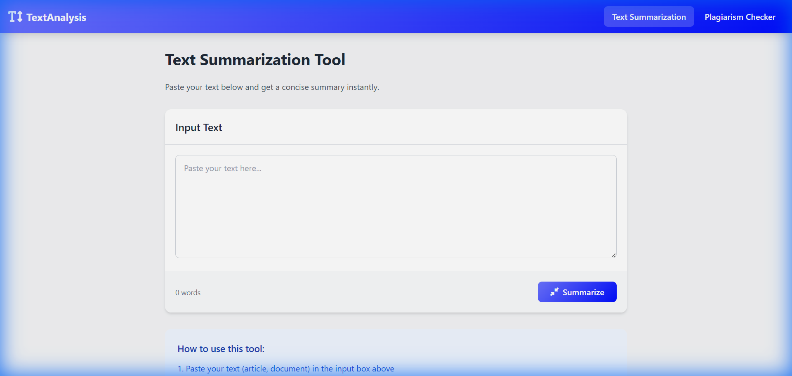

# ML-based Text Summarizer and Plagiarism Detection System



## Overview
This is a sophisticated web application that leverages Machine Learning to provide two main functionalities:
1. **Text Summarization**: Generates concise, abstractive summaries of long text using the `t5-small` model.
2. **Plagiarism Detection**: Checks text against a database of sources using Semantic Textual Similarity (SBERT `all-MiniLM-L6-v2`) to identify potential plagiarism.

The system is built with **Flask** for the backend and provides a clean, user-friendly interface.

## Features
- **Abstractive Summarization**: Uses deep learning to understand content and generate meaningful summaries, not just extract sentences.
- **Deep Plagiarism Check**: uses cosine similarity on sentence embeddings to find semantically similar sources, which is more robust than simple keyword matching.
- **Instant Feedback**: Real-time processing and result display.
- **Word Count**: Automatic word counting for input text.

## Tech Stack
- **Backend Framework**: Flask
- **ML Libraries**: Transformers (Hugging Face), PyTorch, Sentence-Transformers, Scikit-learn, Pandas
- **Models**:
  - Summarization: `t5-small`
  - Embeddings: `sentence-transformers/all-MiniLM-L6-v2`
- **Frontend**: HTML5, CSS3, JavaScript

## Installation

### Prerequisites
- Python 3.8+
- pip

### Steps
1. **Clone the repository**
   ```bash
   git clone https://github.com/SubhankarSarkar01/ML-based-Text-Summarizer-and-Plagiarism-Detection-System.git
   cd ML-based-Text-Summarizer-and-Plagiarism-Detection-System
   ```

2. **Create a Virtual Environment (Recommended)**
   ```bash
   python -m venv venv
   # Windows
   .\venv\Scripts\activate
   # Linux/Mac
   source venv/bin/activate
   ```

3. **Install Dependencies**
   ```bash
   pip install -r Text-Summarizer/requirements.txt
   ```

   > **Note**: For plagiarism detection, ensure you have the `dataset.csv` in the `Plagiarism Detection` folder.

## Usage

1. **Start the Flask Server**
   ```bash
   cd Text-Summarizer
   python app.py
   ```

2. **Access the Application**
   Open your browser and navigate to: [http://127.0.0.1:5000/](http://127.0.0.1:5000/)

3. **Use the Features**
   - **Summarize**: Paste text into the input box and click "Summarize" to get a condensed version.
   - **Plagiarism Check**: Switch to the "Plagiarism Checker" tab, paste text, and run the check to see similarity scores.

## Project Structure
```
ML-based-Text-Summarizer-and-Plagiarism-Detection-System/
├── Plagiarism Detection/       # Plagiarism detection resources
│   ├── dataset.csv             # Source text database
│   └── ...
├── Text-Summarizer/            # Main Flask Application
│   ├── static/                 # CSS, JS, Images
│   ├── templates/              # HTML Templates
│   ├── app.py                  # Flask App Entry Point
│   ├── summarizer_model.py     # Summarization Logic
│   ├── plagiarism_checker.py   # Plagiarism Logic
│   └── requirements.txt        # Python Dependencies
└── README.md                   # Project Documentation
```

## Contributing
Contributions are welcome! Please feel free to submit a Pull Request.
